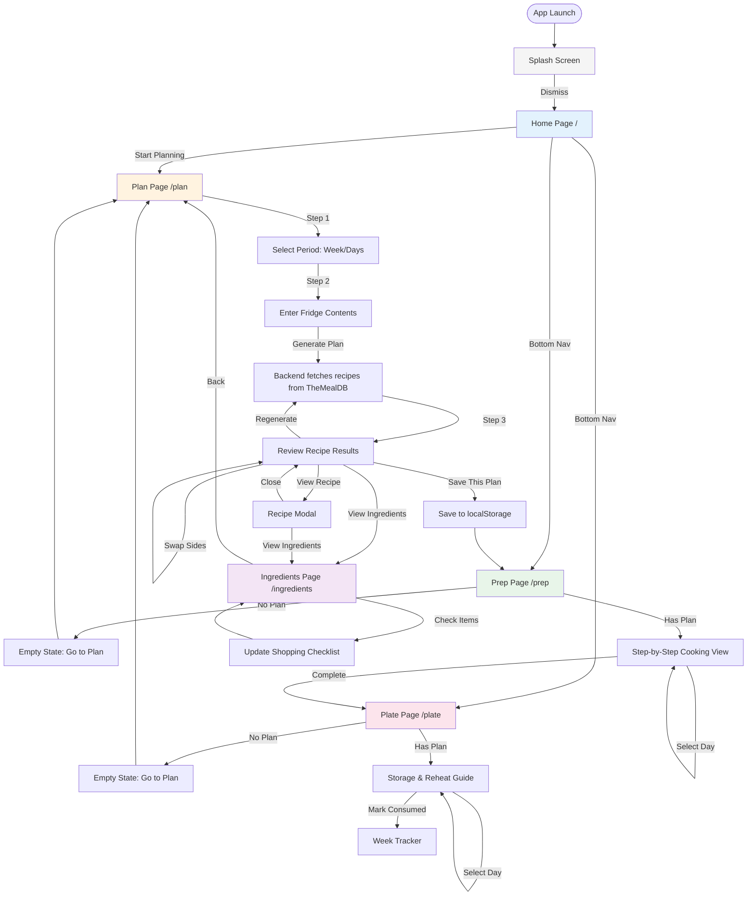

# Prepper Application - User Flow Flowchart

This flowchart shows the complete user journey through the Prepper application.

## Flow Summary

1. **Entry Point**: User launches app → Splash Screen
2. **Home Hub**: Splash dismisses → Home page (with date navigation, favorites, CTA)
3. **Planning Journey**:
   - Step 1: Choose period (whole week or specific days)
   - Step 2: Enter fridge contents
   - Backend fetches recipes from TheMealDB API
   - Step 3: Review, swap sides, regenerate, view recipes
   - Save plan to localStorage
4. **Prep Phase**: Access saved plan, adjust portions, follow step-by-step instructions
5. **Plate Phase**: Storage/reheat guidance, consumption tracking
6. **Ingredients**: Dedicated shopping checklist accessible from Plan
7. **Navigation**: Fixed bottom nav (Home | Plan | Prep | Plate) for quick access

## Key Decision Points

- **Has Saved Plan?** → Determines Prep/Plate content vs empty state
- **Period Selection** → Whole Week vs Individual Days → Affects recipe generation
- **Bottom Nav** → Always accessible for page switching
